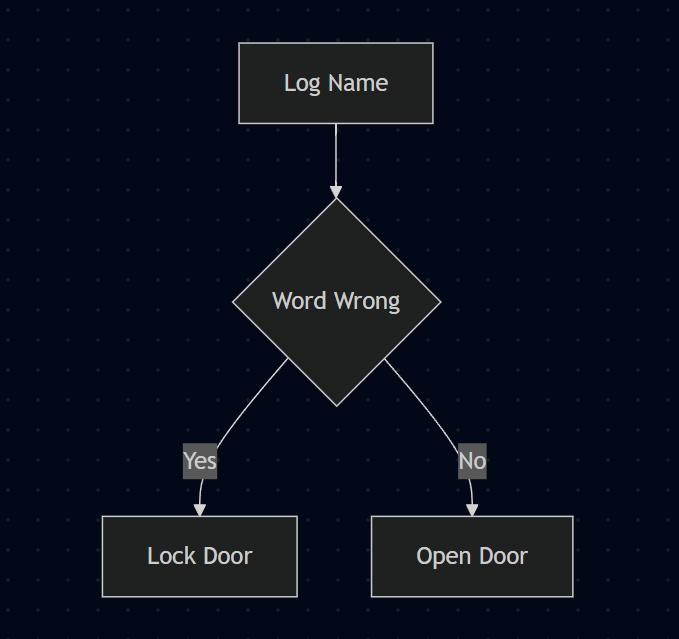

# NanoMermaid: How It Works

*A complete walkthrough of building a language model from scratch — including everything that went wrong.*

**Who this is for:** anyone with basic computer science knowledge. You should be comfortable with functions, arrays, and loops. You do **not** need machine learning experience, calculus, or linear algebra. Concepts are introduced as they become necessary.

---

## Table of contents

1. [The problem](#1-the-problem)
2. [What a language model actually is](#2-what-a-language-model-actually-is)
3. [Step one: the tokenizer](#3-step-one-the-tokenizer)
4. [Step two: the architecture](#4-step-two-the-architecture)
5. [Step three: pretraining](#5-step-three-pretraining)
6. [Step four: teaching the actual task](#6-step-four-teaching-the-actual-task)
7. [Step five: measuring whether it worked](#7-step-five-measuring-whether-it-worked)
8. [Step six: generating diagrams](#8-step-six-generating-diagrams)
9. [Seven bugs and how we found them](#9-seven-bugs-and-how-we-found-them)
10. [What this project actually taught](#10-what-this-project-actually-taught)
11. [Glossary](#glossary)

---

## 1. The problem

**Mermaid** is a text format for describing diagrams. You write text, and a renderer draws a picture:

```
graph TD
    A[Log Name] --> B{Word Wrong}
    B -- Yes --> C[Lock Door]
    B -- No --> D[Open Door]
```

renders as a flowchart: a box labelled "Log Name" with an arrow to a diamond labelled "Word Wrong", which branches to two more boxes (Figure below).



The goal: **type a description in English, get the Mermaid code back.**

```
Input:  "Do Log Name. If Word Wrong then Lock Door else Open Door."
Output: the code block above
```

You could write this with regular expressions and pattern matching. We didn't — we trained a neural network to do it, from nothing. No downloaded weights, no pretrained model, no `AutoModel.from_pretrained()`. Every component was built and trained on a laptop with a 4GB graphics card.

The finished model has **23.3 million parameters**. For comparison, the large commercial models are estimated at a trillion or more. Ours is roughly one hundred-thousandth the size.

---

## 2. What a language model actually is

### It predicts the next piece of text

That's the whole idea. A language model takes a sequence of text and outputs a probability for what comes next.

Give it `"The cat sat on the"` and it produces something like:

```
"mat"    → 31%
"floor"  → 12%
"chair"  →  8%
"table"  →  6%
...        (and a small probability for every other possibility)
```

To generate text, you pick one, append it, and ask again. Repeat until done. That's all "AI writing" is underneath — next-piece prediction, run in a loop.

### It works with tokens, not letters or words

The "pieces" aren't characters and aren't quite words. They're **tokens** — chunks learned from data. Common words become single tokens; rare words split into fragments.

```
"the cat sat"        →  ["the", " cat", " sat"]            3 tokens
"Elasticsearch"      →  ["Elast", "ic", "se", "arch"]      4 tokens
```

This matters more than it sounds, and it caused two of our seven bugs.

Each token has an integer ID. The model only ever sees integers. `"the"` might be token 464. The model's job is: given `[464, 2415, 3332]`, output a probability for each of the 8,192 possible next tokens.

### Learning = adjusting numbers until predictions improve

The model is a large collection of numbers called **parameters** (ours has 23,344,128 of them). They start random, so initial predictions are random.

Training loop:

1. Show it real text with the answer hidden
2. It guesses
3. Measure how wrong the guess was — this number is the **loss**
4. Nudge every parameter slightly in whatever direction reduces the loss
5. Repeat millions of times

Step 4 is **backpropagation**, and libraries like PyTorch handle it for you. You don't need to understand the calculus to use it — but you do need to understand what loss means, because misreading loss caused several of our bugs.

### Reading a loss number

Loss is measured in **nats**. The useful intuition:

- Loss = ln(N) means "the model is guessing uniformly among N options"
- Our vocabulary is 8,192 tokens, so **ln(8192) = 9.01** is the loss of a model that knows nothing
- Loss 2.0 means roughly "it has narrowed each guess to about 7 plausible options"
- Loss 0.01 means "it is essentially certain and essentially right"

Our pretraining went from 9.01 (random) to **1.887**. Fine-tuning reached **0.0086**.

> ⚠️ **Loss going down does not mean the model is good.** This is the single most important idea in this document, and section 7 is entirely about it.

---

## 3. Step one: the tokenizer

Before any learning, we need to convert text into token IDs. That's the tokenizer's job, and we trained our own.

### How BPE works

**Byte-Pair Encoding** starts with individual characters and repeatedly merges the most frequent adjacent pair.

Suppose your corpus is full of the word "lower":

```
Start:    l  o  w  e  r
"e"+"r" appears constantly     →  l  o  w  er
"l"+"o" appears constantly     →  lo w  er
"lo"+"w" appears constantly    →  low er
```

Each merge becomes a permanent rule. Run this 7,929 times and you have a vocabulary of 8,192 tokens (7,929 merges + 256 possible bytes + 7 special tokens).

**The vocabulary depends entirely on what text you train it on.** A tokenizer trained on children's stories learns merges for "mommy" and "puppy". It never learns "Elasticsearch", so that word shatters into fragments.

### Special tokens

We reserved seven IDs for control signals rather than text:

| Token | Purpose |
|---|---|
| `<\|pad\|>` | filler to make batch items equal length |
| `<\|unk\|>` | unknown (never actually needed — byte-level covers everything) |
| `<\|startoftext\|>` | document start |
| `<\|endoftext\|>` | document end / stop generating |
| `<\|mermaid\|>` | "a diagram task follows" |
| `<\|prompt\|>` | "the description ends here, diagram begins" |
| `<\|response\|>` | reserved |

These act like structural markers. When generating, we feed the model `<|mermaid|>` + description + `<|prompt|>`, and it understands that a diagram should follow.

### Byte-level: why no word is ever unknown

We used **byte-level** BPE. Before merging, every character is broken into raw bytes. Since there are only 256 possible byte values and all 256 are in the vocabulary, **any** possible input can be represented — emoji, Chinese, corrupted data, anything. Worst case it's slow, never impossible.

A quirk you'll see throughout this document: byte-level tokenizers display spaces as `Ġ` and newlines as `Ċ`. So `' cat'` shows as `Ġcat`. This looks like a bug but is intentional — it makes whitespace visible and unambiguous.

---

## 4. Step two: the architecture

Our model is a **decoder-only transformer** — the same family as GPT. Here is what's inside, in plain terms.

### The overall shape

```
token IDs  →  embeddings  →  6 transformer blocks  →  output layer  →  probabilities
```

**Configuration:**

| Setting | Value | Meaning |
|---|---|---|
| `vocab_size` | 8,192 | how many distinct tokens exist |
| `n_layer` | 6 | how many transformer blocks stacked |
| `n_head` | 8 | parallel attention mechanisms per block |
| `n_embd` | 512 | size of the vector representing each token |
| `max_seq_len` | 512 | longest input the model can read |
| **Total parameters** | **23,344,128** | |

### Embeddings: turning IDs into meaning

Token ID 464 means nothing numerically — it's just an index. So the first layer is a lookup table (`wte`, "weights of token embeddings") mapping each of the 8,192 IDs to a list of 512 numbers.

These 512 numbers are the model's learned representation of that token. Similar tokens end up with similar vectors. Nobody designs this; it emerges from training.

There's a second table, `wpe` ("weights of position embeddings"), for **position**. Attention (below) has no inherent sense of order, so we add a position vector to each token vector to say "this is the 5th token."

```
input_to_model = wte[token_id] + wpe[position]
```

> This addition is where **Bug #1** lived. If the two vectors have wildly different magnitudes, one drowns out the other.

### Attention: how tokens look at each other

This is the core idea of transformers, and it's the mechanism that made this project work.

For each token, the model computes three vectors:

- **Query** — "what am I looking for?"
- **Key** — "what do I offer?"
- **Value** — "what information do I carry?"

Every token's Query is compared against every other token's Key. High similarity means high attention, and the attending token pulls in that token's Value.

Concretely: in `"Do Log Name. If Word Wrong then Lock Door"`, when the model is writing the diagram and needs the first node's label, the position where the label belongs emits a Query meaning roughly "I need the first action mentioned." The tokens `Log Name` have Keys matching that, so their Values get copied forward.

**That is the copy mechanism this entire project depends on.** In the literature it's called an *induction head*. Our final model performs it correctly 99.6% of the time — including on strings it has never seen, like `Inallyarchivfi Neass`.

**Causal masking** enforces that a token may only attend to earlier tokens, never later ones. Otherwise predicting the next word would be trivial — the model would just look at it.

**Multi-head** means 8 independent attention mechanisms run in parallel, each free to specialize. One might track subject-verb agreement, another bracket matching.

### The rest of the block

Each of the 6 blocks is:

```
x = x + attention(layernorm(x))
x = x + feedforward(layernorm(x))
```

- **Feedforward** — a small 2-layer network applied to each position independently. Attention moves information between positions; feedforward processes it in place.
- **LayerNorm** — rescales numbers to a consistent range so training stays stable.
- **`x = x + ...`** — a **residual connection**. The block *adds* to its input rather than replacing it, so information flows unchanged through all 6 layers if needed. Without these, deep networks train very poorly.

### Weight tying

The output layer maps 512 numbers back to 8,192 scores — one per possible next token. That's a 512 × 8,192 table, exactly the same shape as the input embedding table.

We **share the same table for both**, saving 4.2 million parameters and encoding a sensible assumption: if two tokens mean similar things going in, they should be similarly likely coming out.

> This innocuous optimization is why **Bug #1** stayed hidden for so long.

---

## 5. Step three: pretraining

### Why teach it children's stories first

Our actual goal is diagrams. So why start with bedtime stories?

Because a model that has never seen language would have to learn *everything* at once: that text has grammar, that words refer to earlier words, that brackets pair up. Pretraining on ordinary English builds all that general machinery. Fine-tuning then only has to teach the specific task.

Crucially, pretraining is what builds the **attention circuits that track references across a sentence** — the exact machinery later repurposed to copy a label from a description into a diagram node.

We used **TinyStories**: a synthetic dataset of short stories written using only vocabulary a 3–4 year old would know. Perfect for this — real grammatical English, tiny vocabulary, so a small model can actually learn it.

### The numbers

| | |
|---|---|
| Documents used | 300,000 |
| Tokens produced | 63.5 million (+3.3M held out) |
| Training steps | 3,000 |
| Tokens per step | 16,384 (batch 16 × 2 accumulation × 512 context) |
| **Tokens actually seen** | **49.2 million** |
| Time | ~5 hours on a GTX 1650 Ti (4GB) |

49.2M of 63.5M means **the model never saw a repeated token during pretraining** — under one full pass through the data.

### Mechanics worth understanding

**Memory-mapped binaries.** Tokenizing 300k documents takes ~15 minutes, so we did it once and saved the IDs as a raw binary file of 16-bit integers (`uint16` — sufficient since our vocabulary is only 8,192). Training then reads directly from disk via memory mapping, with no re-tokenization and no loading 127MB into RAM.

**Gradient accumulation.** Larger batches give more stable training, but a 4GB card can't hold a big batch. Solution: process 16 examples, keep the gradients, process 16 more, *then* update. You get the stability of batch 32 with the memory of batch 16.

**Mixed precision (AMP).** Store numbers in 16-bit instead of 32-bit — halves memory and roughly doubles speed. Risk: 16-bit floats can't represent very small numbers, so tiny gradients round to zero. A `GradScaler` fixes this by multiplying the loss by a large constant before backpropagation and dividing it back out after.

**Learning rate schedule.** The learning rate controls step size when adjusting parameters.

```
       6e-4  ┤    ╭──────╮
             │   ╱        ╰──╮
             │  ╱             ╰────╮
       6e-5  ┤ ╱                    ╰────
             └─────────────────────────────
              0   300              3000
                warmup    cosine decay
```

Warmup avoids destructive early steps when everything is random. Cosine decay lets the model settle into a good solution rather than bouncing around it forever.

### Watching it learn

The most satisfying part is sampling text at intervals. All three below start from `"Once upon a time"`:

**Step 500** — grammar is forming but meaning drifts:
> *"Lily's mom came over to her dress and went to see what was."*

**Step 1500** — coherent sentences, correct dialogue punctuation:
> *"Lily saw a big dog with a serious face. 'Mommy, look! It is so funny!' Lily said."*

**Step 3000** — clean multi-clause structure, correct pronouns:
> *"Timmy's mom told him that the dog was not nice."*

Validation loss: **3.64 → 1.887**, decreasing at every single checkpoint.

---

## 6. Step four: teaching the actual task

Now the model speaks simple English. It knows nothing about diagrams. **Fine-tuning** continues training on task-specific examples.

### Building training data

We need thousands of (description, diagram) pairs. Nobody has that dataset, so we generated it.

**Templates** define diagram shapes with slots:

```python
{
  "name": "decision",
  "frames": ["{CHECK} {cond_1}. {IFYES} {act_1}, {IFNO} {act_2}."],
  "mermaid": "graph TD\n    A{{{cond_1}}} -- Yes --> B[{act_1}]\n    A -- No --> C[{act_2}]"
}
```

Fill the slots and you get a matched pair:

```
Description: "Check if Box Full. If yes, Save List, if no, Ask Name."
Diagram:     graph TD
                 A{Box Full} -- Yes --> B[Save List]
                 A -- No --> C[Ask Name]
```

The final system had **10 diagram shapes** — chains of 2/3/4 steps, decisions, loops, forks, merges, three-way branches.

### Two independent kinds of variety

This distinction turned out to be the crux of the whole project.

**Slot values** — what goes *in* the boxes. Built by combining word lists: 67 actions × 63 objects = 4,221 possible action labels, plus 2,368 condition labels.

**Paraphrases** — how the sentence is *worded*. `"First A, then B"` and `"Start with A, next B"` describe the same diagram.

For paraphrases we wrote a **grammar** rather than individual sentences. Each template declares sentence frames plus interchangeable connectives:

```python
"frames": ["{OPEN} {act_1}, {THEN} {act_2}."],
"words": {
    "OPEN": ["First", "Start with", "Begin with", "You start with", "Step one is"],
    "THEN": ["then", "next", "after that", "followed by"]
}
```

5 × 4 = 20 sentences from one frame. Across all templates this produced **3,138 paraphrases** from a compact specification.

### Generating on the fly

Early on we pre-generated a fixed file of 20,000 pairs and reused it every epoch. This was a serious mistake (Bug #2).

The fix: generate each training pair **fresh, at the moment it's needed**. With 4,221 possible values per slot and thousands of paraphrases, the model essentially never sees the same example twice. Memorization becomes impossible; the only way to reduce loss is to actually read the description.

### Loss masking

A subtle but important detail. Each training example is one sequence:

```
<|mermaid|> Check if Box Full. If yes... <|prompt|> graph TD  A{Box Full}...
└───────────── the description ─────────┘ └────── the diagram ──────┘
```

We only want the model graded on producing the **diagram**. Predicting the description is not the task.

So we set the target to `-1` for every description position. PyTorch's loss function ignores `-1` targets entirely. The model still *reads* the description (it's in the input), but 100% of the gradient goes toward generating diagrams.

### Dynamic padding

Neural networks process examples in batches, and every item in a batch must be the same length. Our sequences average 44 tokens.

We originally padded everything to `max_seq_len` = 512. That means **88% of every computation was spent on meaningless padding.** Padding to the longest item *in each batch* instead gave roughly a 10× speedup.

### Selecting the best checkpoint

Standard practice is to save whichever checkpoint has the lowest validation loss. **We deliberately didn't.** We saved whichever had the highest slot-copying accuracy — for reasons that section 7 makes clear.

**Final result:** exact diagram match **0.516 → 0.984** over 24 epochs (~33 minutes on a free Colab T4).

---

## 7. Step five: measuring whether it worked

**This section is the most important one.** Most of our real problems were measurement problems.

### Why loss is a bad judge here

Suppose the correct output is:

```
graph TD
    A[Grab Milk] --> B[Heat Pot]
```

and the model produces:

```
graph TD
    A[Read Book] --> B[Send Note]
```

Structurally perfect. Completely wrong content. But loss barely notices — the labels are a handful of tokens out of ~45, and the model was confidently correct on all the structural ones. **Validation loss of 0.87 looked respectable while the model was ignoring the input entirely.**

This actually happened. An early model, asked about `Payment / Confirm Order / Reject Order`, produced `Login / Grant Access / Block Request` — a coherent diagram about something else, with a good-looking loss.

### The metric we built instead

**Slot exact-match**: generate the diagram, then check whether each label from the description appears verbatim in the output.

Three numbers:

| Metric | Definition |
|---|---|
| `slot_acc` | fraction of individual labels copied correctly |
| `sample_acc` | fraction of diagrams where **every** label is correct |
| `exact_match` | fraction where the whole diagram matches exactly |

This has no blind spot. Either the label is there or it isn't.

### Splitting the metric to see what's really happening

We split validation into two halves:

- **pool** — labels built from the known word lists (`Grab Milk`)
- **novel** — arbitrary multi-token gibberish (`Inallyarchivfi Neass`)

**The gap between these two numbers is the diagnosis.** High pool + low novel means the model is guessing plausible words from memory rather than copying. Both high means real copying.

Final scores: pool **0.995**, novel **0.974**. Genuine copying.

### The diagnostic that resolved everything

At one point every score said 0.98 while hand-typed prompts failed badly. The validation set varied *two* things at once — unseen labels **and** unseen phrasings — so a single number couldn't say which was the problem.

We built `diagnose.py` to vary **one at a time**:

| Test | Labels | Phrasing | Score |
|---|---|---|---|
| control | seen | seen | 1.000 |
| **values** | **new** | seen | **0.980** |
| **phrasing** | seen | **new** | **0.525** |
| both | new | new | 0.505 |

Unambiguous. Copying cost **2 points**. Unfamiliar phrasing cost **47.5 points**.

This changed the entire plan. We had been about to run longer training — which would have achieved nothing. The real fix was expanding paraphrase coverage 26×, from 120 to 3,138. After that, phrasing accuracy went to 0.995.

**One diagnostic, ten minutes to run, saved days of pointless training.**

---

## 8. Step six: generating diagrams

Training is done. How do we actually get output?

### The generation loop

```python
tokens = [<|mermaid|>] + encode(description) + [<|prompt|>]
for _ in range(max_new_tokens):
    probabilities = model(tokens)      # scores for all 8,192 next tokens
    next_token = pick(probabilities)
    tokens.append(next_token)
    if next_token == <|endoftext|>: break
```

### Why we pick greedily

`pick()` has options. **Sampling** picks randomly, weighted by probability — good for creative writing, where variety is desirable. **Greedy** always takes the most likely token.

We use greedy. Mermaid syntax has exactly one correct answer; randomness can only introduce errors. An early version used `temperature=0.5, top_k=40`, which actively randomized the label tokens the model was least sure about — precisely the tokens we most needed correct.

### Constrained decoding

Every diagram must start with `graph TD`. Rather than hope, we **force** those tokens: mask all other options to probability zero for the opening tokens, then let the model generate freely.

> This forcing is where **Bug #6** lived, and it's the subtlest bug in the project.

### The sanitizer

A small function repairs common syntax slips — unbalanced brackets, `[foo}` mismatches, stray blank lines. It's a safety net, not a crutch; a well-trained model rarely triggers it.

---

## 9. Seven bugs and how we found them

Here's the honest part. Every one of these was invisible until something specific exposed it.

---

### Bug #1: Positional embeddings 50× too large

**The code:**

```python
def _init_weights(self, module):
    if isinstance(module, nn.Linear):
        torch.nn.init.normal_(module.weight, std=0.02)
        if module.bias is not None:
            torch.nn.init.zeros_(module.bias)
        elif isinstance(module, nn.Embedding):    # ← unreachable
            torch.nn.init.normal_(module.weight, std=0.2)
```

Look at the indentation. The `nn.Embedding` branch is nested inside the `nn.Linear` branch, as an `elif` of `if module.bias is not None`. **A module cannot be both a Linear and an Embedding.** That branch could never execute.

**Why it hid so well.** Token embeddings were fine — remember weight tying? `wte` shares its table with `lm_head`, which *is* a `Linear`, so it got initialized correctly by the first branch.

But **position** embeddings (`wpe`) aren't tied to anything. They kept PyTorch's default `N(0, 1)`.

Measured:

```
FIXED        wte.std=0.0200   wpe.std=0.0200   ratio=1.0×
BUGGY        wte.std=0.0200   wpe.std=0.9986   ratio=49.9×
```

**Why it mattered.** The input is `wte[token] + wpe[position]`. With position 50× louder, the model could see *where* it was far more clearly than *what was there*. Copying requires matching on token content — the bug was directly suppressing the signal the copy circuit needed.

**Found by:** writing a test that printed initial loss and embedding statistics. Correct initial loss should equal ln(8192) = 9.01.

**Lesson:** verify initialization numerically. Never assume it worked because the code looks reasonable.

---

### Bug #2: A vocabulary small enough to memorize

**Symptom:** train loss 0.155, validation loss 0.87. The model produced perfect diagrams with entirely wrong labels.

**The arithmetic.** Each slot had 10 possible values. Memorizing "this is the decision template, then guess one of 10" costs ln(10) ≈ 2.3 nats on a few tokens. Learning to attend back and copy is *harder*. Gradient descent takes the easier path — always.

Worse, we then pre-generated 20,000 fixed pairs and reused them every epoch:

```
epoch 1: train loss 1.4587    ← learning
epoch 2: train loss 0.4418    ← learning
epoch 3: train loss 0.0297    ← memorized
epoch 5: train loss 0.0002    ← no gradient signal left
...
epoch 17: train loss 0.0000
```

**14 of 17 epochs — about 2.5 hours of GPU time — produced essentially no learning.** Once training loss is zero there is nothing to learn from.

**The fix, in two parts:**
1. Expand the value space from 10 per slot to thousands (4,221 action labels), making memorization impractical
2. Generate pairs **on the fly** so no example ever repeats

**Found by:** noticing train loss 0.0000 and asking what that implies. A perfect training score is not success — it means learning has stopped.

---

### Bug #3: A tokenizer trained on its own answer key

We trained the tokenizer on TinyStories **plus 40,000 renderings of our own slot vocabulary**. Those 150 words appeared so often they each earned a dedicated single token.

Measured on the resulting tokenizer:

```
IN the training vocabulary:
   2 tokens | Filter Dossier      ['ĠFilter', 'ĠDossier']

NOT in the training vocabulary:
   8 tokens | Scan Barcode        ['ĠS','c','an','ĠB','ar','c','od','e']
   7 tokens | Notify Customer     ['ĠNot','if','y','ĠC','ust','om','er']
```

**The model was trained to copy 2-token spans. Real input required copying 7–8 token spans.** Completely different difficulty. Copying isn't one operation — it's a chain of positional lookups, one per token, and every extra token is another link that can break.

**The fix — invert the dependency.** Instead of training the tokenizer on our vocabulary, *filter our vocabulary by what the tokenizer already handles cheaply*:

```python
def _filter(self, words):
    return [w for w in words if len(tokenizer.encode(" " + w).ids) <= 2]
```

We supplied 77 candidate actions, 69 objects, 42 conditions; whatever cost 3+ tokens was dropped automatically. No tokenizer retraining, no re-pretraining.

**Found by:** typing prompts with words we'd invented on the spot, then checking how they tokenized.

**Lesson:** circular dependencies in a data pipeline are very hard to see from inside. The tokenizer was optimized for the test set because the test set *made* the tokenizer.

---

### Bug #4: A metric that awarded free points

Slot accuracy checked `if value in generated_text` — a plain substring test.

But Mermaid node IDs are `A`, `B`, `C`, `D`, and edge labels are `Yes` and `No`. One of our templates used bare letters as labels. So:

```python
"B" in "graph TD\n A[x] --> B{y}\n B -- Yes --> C[Z]"   # True. Always true.
```

A label slot with value `"B"` matched **any diagram ever produced**. Roughly 10% of the evaluation set was scoring automatically.

**The fix:** check the value *in its structural context*, derived from the template pattern. The template says `C[{label_1}]`, so search for `[B]`, not `B`.

A first attempt took context from the *rendered target* instead of the template — and still failed, because in `B -- Yes --> C[Yes]` the first occurrence of `Yes` is the edge label, not the node.

**Verified two ways:** a deliberately-wrong output now fails on labels, and all 1,000 ground-truth targets still score 100% (proving the check isn't over-strict).

**Lesson:** test your metric against a known-bad output. If it doesn't fail, it isn't measuring.

---

### Bug #5: 88% of compute spent on padding

Sequences averaged 44 tokens. We padded every one to 512.

```
mean padded length: 43.9 tokens   (previously: always 511)
compute saved: 91.4%
```

An epoch took 775 seconds; nearly all of it was multiplying zeros.

**The fix:** pad to the longest sequence *in each batch* via a custom `collate_fn`. Roughly 10× faster, and it also cut memory enough to matter on a 4GB card.

**Found by:** printing actual tensor shapes instead of trusting the intended design.

---

### Bug #6: Same text, different tokens

The subtlest one, and the last found.

Constrained decoding forced the opening `"graph TD\n"`. Every generated diagram came out with its first node broken:

```
Expected:  A[Grab Milk] --> B[Heat Pot]
Got:        [Grab Milk] --> B[Heat Pot]      ← "A" missing
```

Line 2 was always perfect. Only line 1 broke, every single time.

**The mechanism:**

```python
encode("graph TD\n")        → ['graph', 'ĠTD', 'Ċ']
encode("graph TD\n    A[")  → ['graph', 'ĠTD', 'ĊĠĠĠ', 'ĠA', '[']
```

Look at the third token. In isolation, the newline is its own token `'Ċ'`. In the real training data, **the newline merges with the following three spaces into a single token `'ĊĠĠĠ'`.**

Identical characters. Different token IDs.

By forcing `'Ċ'`, we placed the model at a token it had never once seen in that position. Off-distribution, it skipped the indentation and node letter entirely. Confirmed from the raw token stream:

```
['graph', 'ĠTD', 'Ċ',      '[', 'Gra', 'b', ...]   ← forced 'Ċ', then broken
[...,     'ĊĠĠĠ', 'ĠB', 'Ġ-->', 'ĠC', ...]         ← natural, correct
```

**The fix:** force `"graph TD\n    A"` instead, so the forced token IDs match training exactly.

**Why it evaded detection.** The evaluation harness used a *different* decode function that didn't force a header at all. The metric said 0.984 — honestly, for the model — while the inference path was broken. **The eval and the inference path didn't share code.**

**The general rule:** when constraining generation, compare *token IDs*, not text:

```python
encode(prefix).ids == encode(full_target).ids[:len(encode(prefix).ids)]
```

If that's `False`, your constraint is off-distribution even though the strings look identical. This is a known problem class called *token healing*.

---

### Bug #7: Grading with the answer key

The one that reappeared throughout the project in different disguises.

Every metric read 0.98+. Then a hand-typed prompt produced this:

```
Prompt: "Grab the milk, heat it up, then pour a cup."
Output: graph TD
            [Grab] --> B[Re]
            B --> C[A]
```

Total failure — on input that looked easy.

**Why the metrics missed it:** the validation set was produced by *the same generator* as the training set. Different values, different sentences, but the same underlying grammar, the same casing conventions, the same style. It could not measure behaviour outside the generator's world.

**The fix, in two parts:**
1. `diagnose.py` — vary one axis at a time to identify which dimension actually fails
2. Continuously test with hand-typed input from outside the system

**The uncomfortable truth:** every real bug in this project — Bug #3, Bug #6, and this one — was found by a human typing something ad hoc, not by any validation number.

---

## 10. What this project actually taught

### Small models are capable within narrow domains

23.3M parameters, 49.2M training tokens, pretrained on children's stories, and it reaches 0.984 exact match on structured diagram synthesis. That's ~0.001% of a frontier model's parameters.

Capability isn't a single axis. Large models are *general* because they were trained to be. A narrow, well-specified task with clean data needs a startlingly small fraction of that capacity.

### Data and evaluation mattered far more than the model

Not one improvement came from changing the architecture. The model file barely changed after the initialization fix. Every gain came from:

- fixing the data (values, paraphrases, on-the-fly generation)
- fixing the tokenizer relationship
- fixing the metric
- fixing the inference path

Going from 0.49 → 0.984 was entirely a data and measurement exercise.

### Loss is a proxy, not the goal

Validation loss 0.87 looked fine while the model ignored its input completely. Validation loss cannot distinguish a model that copies from one that guesses plausibly, because the tokens that differ are a small fraction of the sequence.

**Build a metric that measures what you actually want.** For us that was: does the label from the prompt appear, verbatim, in the right structural position?

### Train loss of zero is an alarm, not an achievement

Zero training loss means zero gradient means no learning. When we saw 0.0000 at epoch 5 of 17, that was 2.5 hours of GPU time already wasted.

### Your evaluation and your inference must share code

Bug #6 existed *because* they didn't. The metric was measuring one code path while users hit another.

### Test with inputs from outside your system

This is the summary lesson. Generated validation data can only tell you about the generator. The bugs that mattered were found by typing something the generator would never produce.

---

## Glossary

| Term | Meaning |
|---|---|
| **Attention** | mechanism letting each token pull information from other tokens |
| **Backpropagation** | algorithm computing how to adjust each parameter to reduce loss |
| **Batch** | group of examples processed together |
| **BPE** | Byte-Pair Encoding; builds a vocabulary by merging frequent character pairs |
| **Causal masking** | preventing a token from attending to later tokens |
| **Checkpoint** | saved snapshot of model parameters |
| **Embedding** | learned vector representing a token or position |
| **Epoch** | one pass over the training data (for us: a fixed number of fresh samples) |
| **Fine-tuning** | further training of a pretrained model on a specific task |
| **Gradient accumulation** | simulating a large batch by summing gradients over several small ones |
| **Greedy decoding** | always picking the highest-probability next token |
| **Induction head** | attention pattern that copies content from earlier in the sequence |
| **Learning rate** | how large a step to take when adjusting parameters |
| **Loss** | numeric measure of prediction error; lower is better |
| **Memory mapping** | reading a file directly from disk as if it were an array |
| **Mixed precision** | using 16-bit numbers to save memory and time |
| **Overfitting** | memorizing training data instead of learning general patterns |
| **Parameter** | one of the model's learned numbers |
| **Pretraining** | initial training on general text before task-specific training |
| **Residual connection** | adding a layer's input to its output so information flows through |
| **Token** | the unit of text a model processes; a word or word-fragment |
| **Validation set** | held-out data used to measure generalization |
| **Weight tying** | sharing one parameter table between input embedding and output layer |

---

*Every number in this document is from an actual training run. The bugs are all real, listed in the order they were found.*
