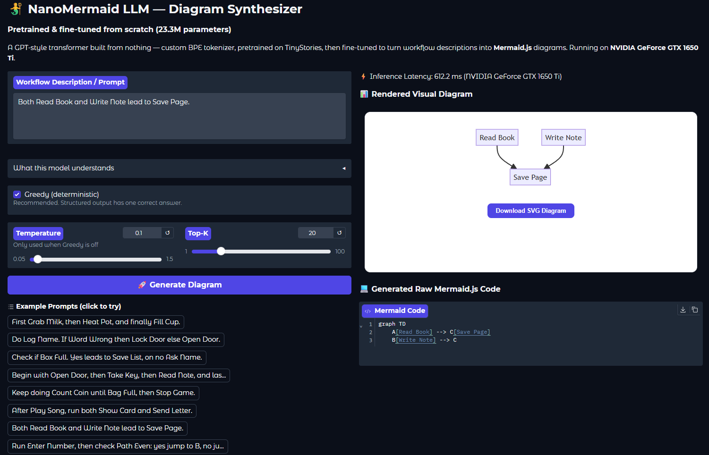
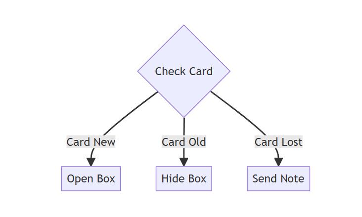
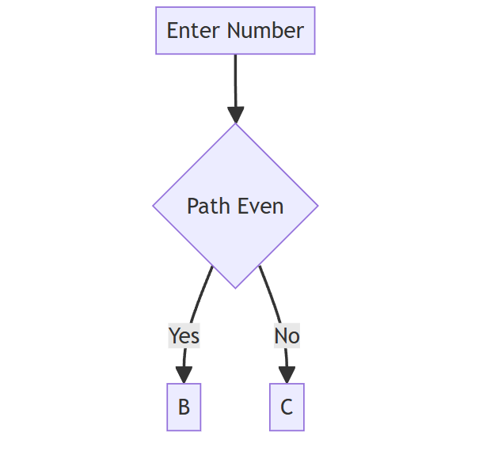
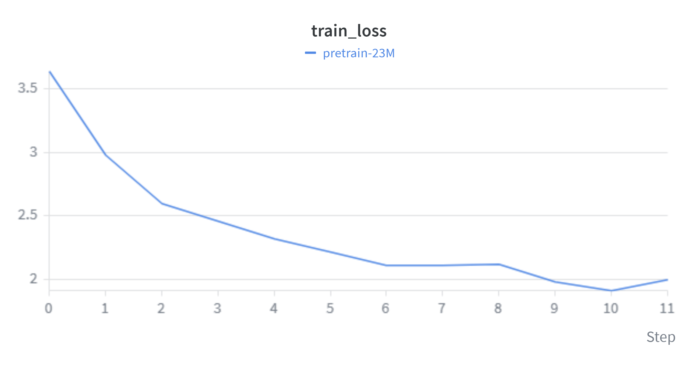
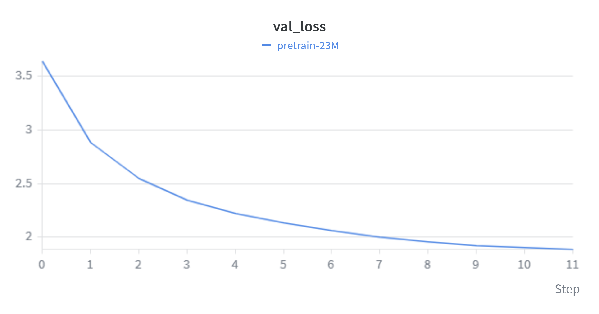

# 🧜‍♂️ NanoMermaid LLM — Diagram Synthesizer

> A **23.3M parameter causal transformer** built, pretrained, and fine-tuned **100% from scratch** in PyTorch on a consumer laptop GPU (**NVIDIA GTX 1650 Ti, 4GB VRAM**), with the final fine-tuning run on a free-tier Colab T4. Translates natural-language workflow descriptions into executable, visual **Mermaid.js** diagrams.

[](https://pytorch.org/)
[](https://wandb.ai/pksahoo-orbit-ai/nano-mermaid-llm)
[](https://gradio.app)
[](#-hardware-footprint--performance)
[](#-results)
[](LICENSE)

---

## 💡 Executive Summary

**NanoMermaid** explores how far a small language model (~23M parameters) can be pushed on domain-specific structured code generation. No pretrained weights, no Hugging Face `AutoModel` — the byte-level BPE tokenizer, transformer architecture, training loops, evaluation harness and inference engine are all implemented here.

The finished model reaches **0.984 exact diagram match** on a validation set where *both* the node labels and the sentence phrasings are unseen during training — at **0.001% of the parameters** of a frontier model, pretrained entirely on children's bedtime stories.

```text
[ Natural Language Workflow ] ──> NanoMermaid (23.3M) ──> [ Mermaid.js DSL ] ──> [ Live Rendered SVG ]
```

<p align="center">
  
</p>

---

## 🎨 Live Examples

<table>
<tr>
<td width="50%" valign="top">

**Three-way branch**

```text
Evaluate Check Card. If Card New use Open Box,
if Card Old use Hide Box, if Card Lost use Send Note.
```



</td>
<td width="50%" valign="top">

**Decision with goto labels**

```text
Run Enter Number, then check Path Even:
yes jump to B, no jump to C.
```



</td>
</tr>
</table>

---

## 🚀 Key Features

* **Built from scratch in PyTorch.** No pre-built model classes. Architecture, BPE tokenizer, training loops and evaluation are pure PyTorch.
* **Instruction-masked fine-tuning.** Prompt tokens are set to `y = -1` so 100% of the gradient goes to generating the diagram, not reconstructing the prompt.
* **Infinite non-repeating training data.** Instruction pairs are sampled *on the fly* from a 229M-combination space, making memorisation impossible and forcing a real copy mechanism.
* **A metric that measures the right thing.** Validation cross-entropy cannot tell a model that copies labels from one that guesses plausible ones. `metrics.py` scores slot-level exact match in structural context instead.
* **Dynamic sequence padding.** Per-batch padding instead of padding to `max_seq_len` removed ~88% of wasted compute and gave a ~10× fine-tuning speedup.
* **Interactive web app.** Gradio UI with isolated iframe renderer, live SVG rendering, and a **📥 Download SVG** export button.

---

## 📊 Results

Measured on a held-out validation set that varies **both** slot values and sentence phrasings — nothing in it appeared during training.

| Metric | Score |
| :--- | :---: |
| **Exact diagram match** | **0.984** |
| All slots copied correctly | 0.984 |
| — on in-vocabulary labels | 0.995 |
| — on never-seen arbitrary spans | 0.974 |
| Per-slot accuracy | 0.996 |
| Validation loss | 0.0086 |

The `0.974` is the one worth pausing on. Those slot values are strings like `Inallyarchivfi Neass` — random multi-token gibberish assembled from vocabulary fragments. The model reproduces them exactly, which means it learned a genuine **span-copy circuit** rather than memorising a lexicon.

### 📉 Loss Trajectories

| Training Loss (`train_loss`) | Validation Loss (`val_loss`) |
| :---: | :---: |
|  |  |

> 🔵 **`pretrain-23M`** (base pretraining)
>
> 📊 Full interactive metrics on [Weights & Biases](https://wandb.ai/pksahoo-orbit-ai/nano-mermaid-llm).

### Language emerging during pretraining

| Step | Sample generation |
| :---: | :--- |
| 500 | *"Lily's mom came over to her dress and went to see what was."* |
| 1500 | *"Lily saw a big dog with a serious face. 'Mommy, look! It is so funny!'"* |
| 3000 | *"Timmy's mom told him that the dog was not nice."* |

---

## 🔍 Scale in Context

This model was trained on **children's bedtime stories**. Its entire understanding of English comes from TinyStories — a synthetic corpus written using only vocabulary a three-to-four-year-old would know. It has never seen a technical document, a line of code, or the word "algorithm".

| | NanoMermaid | Frontier-scale LLM |
| :--- | :---: | :---: |
| Parameters | **23.3 M** | ~2.4 T |
| Training tokens | **49.2 M** | ~15 T |
| Vocabulary | **8,192** | ~128,000 |
| Pretraining corpus | Children's stories | Most of the written internet |
| Hardware | One 4 GB laptop GPU + free Colab T4 | Tens of thousands of datacentre GPUs |
| Wall-clock training | **~5.5 hours + ~33 min fine-tune** | Months |

At **0.001% of the parameters** — roughly one part in 100,000 — and **0.0003% of the training tokens**, NanoMermaid still reaches **0.984 exact match** on structured diagram synthesis.

**Why it works:** capability is not a single axis. Frontier models are general because they were trained to be. A narrow, well-specified task with clean data needs a startlingly small fraction of that capacity. The transferable ingredient from TinyStories is not knowledge — it is *syntax*: the ability to track referents across a sentence, which is the same circuit that later learns to copy a label from a prompt into a diagram node.

The bottleneck in this project was never parameter count. Every improvement from 0.49 → 0.984 came from fixing **data and evaluation**, not from making the model bigger.

---

## 🧠 Model Specs & Hyperparameters

| Architecture Property | Specification |
| :--- | :--- |
| **Model Architecture** | Causal Decoder-Only Transformer (GPT style) |
| **Total Parameters** | **23,344,128** (~23.34 Million) |
| **Vocabulary Size** | 8,192 BPE tokens (trained from scratch) |
| **Context Window** (`max_seq_len`) | 512 tokens |
| **Hidden Dimension** (`n_embd`) | 512 |
| **Transformer Layers** (`n_layer`) | 6 |
| **Attention Heads** (`n_head`) | 8 |
| **Optimizations** | Weight tying (`wte` == `lm_head`), PyTorch 2.0 SDPA, AMP FP16 |
| **Control Tokens** | `<\|pad\|>`, `<\|unk\|>`, `<\|startoftext\|>`, `<\|endoftext\|>`, `<\|mermaid\|>`, `<\|prompt\|>`, `<\|response\|>` |

---

## 📈 Training Journey

```text
  Phase 1: Tokenizer          Phase 2: Architecture          Phase 3: Pretraining          Phase 4: Instruction Fine-Tuning
┌─────────────────────┐    ┌─────────────────────────┐    ┌─────────────────────────┐    ┌────────────────────────────────┐
│ Custom BPE Tokenizer│ ──>│ Pure PyTorch NanoGPT    │ ──>│ 3,000 Steps TinyStories │ ──>│ On-the-fly Instruction Pairs   │
│ Vocab: 8,192 Tokens │    │ Scaled Dot-Product Attn │    │ Val Loss: 3.64 ──> 1.887│    │ Exact Match: 0.516 ──> 0.984   │
└─────────────────────┘    └─────────────────────────┘    └─────────────────────────┘    └────────────────────────────────┘
```

### 1. Tokenization
A custom **byte-level BPE** tokenizer trained on a *mixed* corpus — TinyStories plus rendered Mermaid syntax. Byte-level pre-tokenization guarantees zero `<|unk|>` errors on code symbols, line breaks and structural syntax (`[ ]`, `{ }`, `-->`).

Mixing matters: trained on prose alone, `-->` and indentation fragment into many tokens. Trained on the mixed corpus they become single merges, which is what makes span copying tractable for a model this size.

### 2. Model Architecture
A causal transformer in `src/model.py`:
* Pre-LayerNorm blocks with residual connections
* Scaled Dot-Product Attention (SDPA) with causal masking
* Tied input/output embeddings, saving ~4.2M parameters
* GPT-2 scaled init on residual projections (`std = 0.02/√(2·n_layer)`)

### 3. Base Model Pretraining
* **Dataset:** 300,000 TinyStories documents → **63.5M training tokens** (plus 3.3M held out), pre-tokenized into `uint16` memory-mapped arrays for zero CPU latency.
* **Budget:** 3,000 steps × batch 16 × 2 gradient accumulation × 512 context = **49.2M tokens seen** — 77% of the tokenized corpus, so the model never saw a repeated token during pretraining.
* **Optimization:** AdamW (β₁=0.9, β₂=0.95, weight decay 0.1), cosine annealing 6e-4 → 6e-5 with 300 warmup steps, gradient clipping at 1.0.
* **Result:** validation loss **3.64 → 1.887**, improving monotonically at every evaluation. ~5 hours on the GTX 1650 Ti.

### 4. Instruction Fine-Tuning
* **Dataset:** 10 diagram shapes × **3,138 grammar-generated paraphrases**, with slot values drawn from a tokenizer-filtered lexicon (~4,200 action labels, ~2,400 condition labels). Pairs are generated **on the fly**, so no training example is ever seen twice.
* **Instruction loss masking:** prompt tokens set to `y = -1` (ignored by `CrossEntropyLoss`), so gradients apply only to diagram generation.
* **Checkpoint selection on slot accuracy, not loss** — validation loss cannot distinguish copying from plausible guessing.
* **Result:** exact match **0.516 → 0.984** over 24 epochs (early-stopped from 30). ~33 minutes on a Colab T4.

---

## 💻 Hardware Footprint & Performance

Pretrained entirely on budget consumer laptop hardware:

* **GPU:** NVIDIA GeForce GTX 1650 Ti (4GB VRAM, Turing)
* **CPU:** AMD Ryzen 5 4600HS (6 cores / 12 threads)
* **RAM:** 16GB DDR4 3200MHz
* **Peak pretraining VRAM:** ~2.1 GB / 4.0 GB
* **Peak fine-tuning VRAM:** ~3.2 GB / 4.0 GB 
* **Inference latency:** ~350–550 ms per diagram on the 1650 Ti
* **Throughput:** ~2,640 tokens/sec during training

Fine-tuning (Google Colab, free tier):

* **GPU:** NVIDIA Tesla T4 (16GB)
* **Runtime:** ~33 minutes for 24 epochs (~82 s/epoch)
* Fine-tuning also runs on the 1650 Ti at ~16 min/epoch — the T4 was ~12× faster,
  which is the only reason the run moved to Colab.

---

## 🎯 What It Can and Cannot Do

**It knows 10 diagram shapes:**

| Shape | Example prompt |
| :--- | :--- |
| 2 / 3 / 4-step chain | `First Grab Milk, then Heat Pot, and finally Fill Cup.` |
| Decision | `Check if Box Full. Yes leads to Save List, on no Ask Name.` |
| Step then decision | `Do Log Name. If Word Wrong then Lock Door else Open Door.` |
| Goto labels | `Run Enter Number, then check Path Even: yes jump to B, no jump to C.` |
| Three-way branch | `Evaluate Check Card. If Card New use Open Box, if Card Old use Hide Box, if Card Lost use Send Note.` |
| Loop until | `Keep doing Count Coin until Bag Full, then Stop Game.` |
| Fork | `After Play Song, run both Show Card and Send Letter.` |
| Merge | `Both Read Book and Write Note lead to Save Page.` |

> ⚠️ **Write node labels in Title Case.** The model locates slot values by capitalisation. `Enter Number` gets copied; `enter number` gives it nothing to copy and it will invent labels instead. The web UI warns you when a prompt contains no Title-Case labels.

### Honest limitations

This is a learned **template matcher**, not a language understander:

* It classifies your sentence into one of 10 shapes, then copies Title-Case spans into the slots. Anything outside those shapes is forced into the nearest one.
* Free-form English (`"grab the milk, heat it up"`) fails — turning that into `Grab Milk → Heat Milk` requires rewriting, not copying.
* Out-of-domain input produces plausible-looking **invented** labels rather than an error, which is the more dangerous failure mode.

Within its domain it is reliable. Outside it, it fails confidently.

---

## 📂 Project Structure

```text
nano-mermaid-llm/
│
├── config/
│   └── model_config.json        # Architecture spec (6 layers, 8 heads, 512 embed)
│
├── data/                        # Generated locally (gitignored)
│   ├── processed/               # Tokenized binaries & instruction JSONs
│   └── tokenizer/               # Trained BPE vocabulary
│
├── checkpoints/                 # Model weights (gitignored, see Releases)
│   ├── pretrain/
│   └── finetune_mermaid/
│
├── assets/                      # Screenshots and W&B loss plots
│
├── src/
│   ├── paths.py                 # Single source of truth for every path
│   ├── tokenizer.py             # Phase 1: byte-level BPE, mixed corpus
│   ├── model.py                 # Phase 2: causal GPT architecture
│   ├── dataset.py               # Phase 3: memory-mapped token binaries
│   ├── train_pretrain.py        # Phase 3: pretraining engine + W&B
│   ├── slots.py                 # Phase 4: tokenizer-filtered vocabulary
│   ├── templates.py             # Phase 4: 10 shapes, paraphrase grammar
│   ├── dataset_mermaid.py       # Phase 4: on-the-fly pairs, dynamic padding
│   ├── train_finetune.py        # Phase 4: instruction fine-tuning loop
│   ├── metrics.py               # Slot exact-match evaluation
│   └── generate.py              # Phase 5: inference + syntax sanitizer
│
├── scripts/
│   ├── diagnose.py              # Separates copying from phrasing generalisation
│   ├── check_tokens.py          # Tokenization cost probe
│   ├── debug_raw.py             # Raw model output, pre-sanitisation
│   └── pick_vocab.py            # Finds words the tokenizer handles cheaply
│
├── app.py                       # Phase 5: Gradio UI with iframe SVG renderer
├── requirements.txt
├── .gitignore
└── README.md
```

---

## 🛠️ Quickstart

### 1. Clone & install

```bash
git clone https://github.com/PraneetKSahoo/nano-mermaid-llm.git
cd nano-mermaid-llm
pip install -r requirements.txt
```

### 2. Run the trained model

Download `best_mermaid_model.pt` and `tokenizer.json` from [Releases](../../releases) into:

```text
checkpoints/finetune_mermaid/best_mermaid_model.pt
data/tokenizer/tokenizer.json
```

Both are required — a mismatched tokenizer produces silent garbage rather than an error.

```bash
python src/generate.py "First Grab Milk, then Heat Pot, and finally Fill Cup."
python app.py          # web UI at http://127.0.0.1:7860
```

### 3. Or train the whole pipeline from scratch

```bash
python src/tokenizer.py                              # ~10 min   BPE on mixed corpus
python src/dataset_mermaid.py --train-samples 20000  # ~10 sec   instruction pairs
python src/dataset.py                                # ~15 min   TinyStories → uint16
python src/train_pretrain.py                         # ~5 hrs    resumable
python src/train_finetune.py                         # ~35 min on a T4
```

Both trainers auto-resume from their last checkpoint; `--restart` backs up the existing one and starts fresh.

---

## 📖 Documentation

| document | for |
| :--- | :--- |
| **[HOW_IT_WORKS.md](HOW_IT_WORKS.md)** | Full explanation from first principles — no ML background needed |

---

## 🗺️ Roadmap

* [ ] **Case/filler normalisation** — teach `grab the milk` → `Grab Milk` so free-form English works
* [ ] **Rotary Position Embeddings (RoPE)** — replace learned absolute positions for better length extrapolation
* [ ] **LoRA fine-tuning** — compare low-rank adaptation against full-parameter fine-tuning
* [ ] **More diagram shapes** — `stateDiagram-v2`, `sequenceDiagram`, `subgraph` clustering
* [ ] **Model scaling** — a 100M variant on an expanded corpus

---

## 🙏 Acknowledgements

* Architecture follows Andrej Karpathy's [nanoGPT](https://github.com/karpathy/nanoGPT).
* Pretraining data: [TinyStories](https://huggingface.co/datasets/roneneldan/TinyStories) (Eldan & Li, 2023).
* Tokenization via HuggingFace [`tokenizers`](https://github.com/huggingface/tokenizers).

## 📜 License

Distributed under the MIT License. See [LICENSE](LICENSE) for details.
